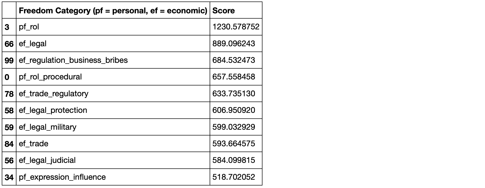
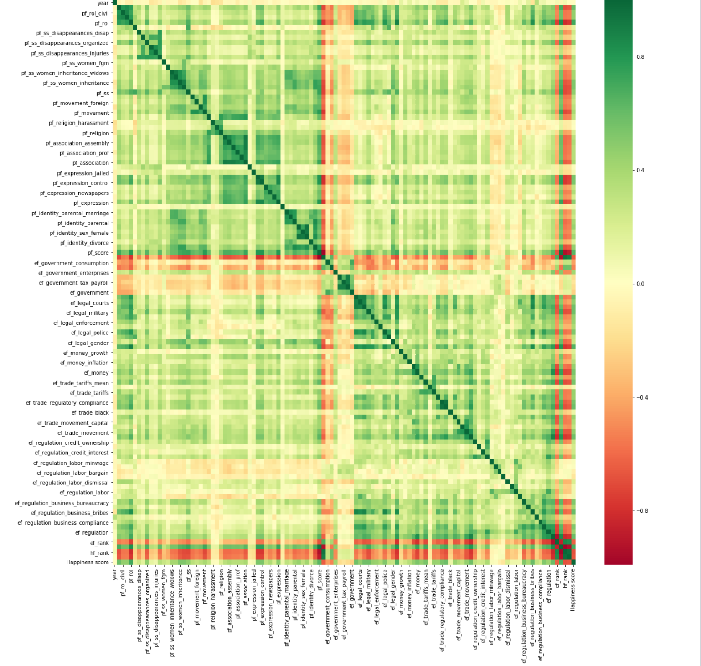
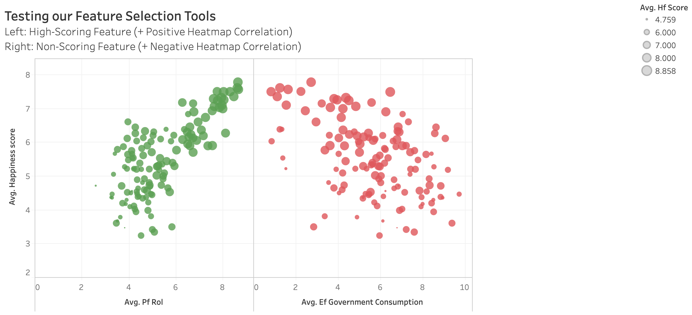
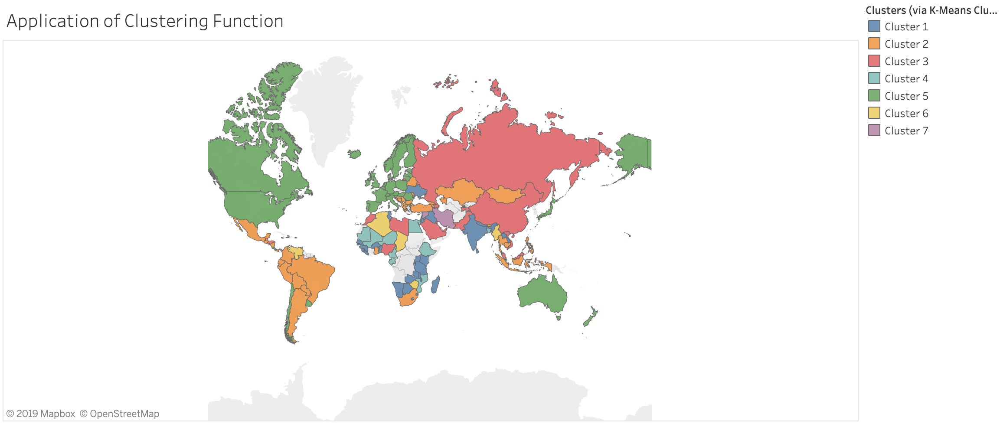

## Can Freedom Predict Happiness? | A Machine Learning Exploration

### Project Description

Using Data fron the Human Freedom Index and the World Happiness Report, I attempted to answer the following question: do freedom measures correlate with happiness measures in a way that can be predicted, or at least provide actionable information? The question is geared toward studying elements of increased well-being in society that might be achieved through analysis and policy. 

This project is a an exploration of machine learning techniques, which builds upon my earlier analysis comparing/contrasting these same datasets, to determine whether these techniques will return similar or different insights from the original analysis. The repository for the initial analsis can be found at https://github.com/Faedra/Freedom-and-Happiness-Analysis.

### Data Sources:

1. #### Happiness Datasets:
     * [World Happiness Report (2019)](https://worldhappiness.report/ed/2019/)
     * [Additional World Happiness Report data on Kaggle](https://www.kaggle.com/unsdsn/world-happiness) (includes happiness scores and rankings from the Gallup World Poll)

2. #### Human Freedom Datasets:
     * [Human Freedom Index from the Cato Institute](https://www.cato.org/human-freedom-index-new) (includes the basic freedom scores and rankings) 
     * [Human Freedom Index exploration on Kaggle](https://www.kaggle.com/gsutters/the-human-freedom-index#hfi_cc_2018.csv) (breaks Cato data into smaller subsets for more detailed study)
     
### Basic Libraries Used (additional libraries listed below in project steps):
    ```
    import pandas as pd
    import numpy as np
    import matplotlib.pyplot as plt
    ```

### Project Steps: Overview

   * Data Prep
   * Feature Selection
   * Correlation + Residual Plots
   * Regression + Scoring Section 1: SKLearn and Train/Test/Split
   * Regression + Scoring Section 2: Keras and TensorFlow
   * Plotting value changes using matplotlib: https://keras.io/visualization/
   * Clustering and Forecasting in Tableau: https://help.tableau.com/current/pro/desktop/en-us/clustering.htm
   
### Data Prep
I imported and merged my datasets, replaced NAN values with column mean values, and saved my new dataframe to csv format for later use.


### Feature Selection: 
#### This is an important step wherein I determine which features in my data will be best to study further, or which might be expected to give me the most significant results for predictive modeling. I tried 3 different feature selection methods to compare/contrast results: Univariate Selection, Heatmap Correlation Matrix, and Feature Importance using XG Boost.

#### Libraries Used:
##### Univariate selection and heatmap correlation matrix:
    ```
    from sklearn.feature_selection import SelectKBest
    from sklearn.feature_selection import chi2, f_regression
    import seaborn as sns
    ```
##### Feature importance using XG Boost:
    ```
    from numpy import loadtxt
    from xgboost import XGBClassifier
    from xgboost import plot_importance
    ```
1. #### Univariate Selection: SelectKBest
I selected my top 10 "best features" using SelectKBest class (selects those features that have the strongest relationship with the output variable, "Happiness Score"). This will help me know which features to focus on in future tests.

The SKlearn library provides the SelectKBest class that can be used with a suite of different statistical tests. The example I ran here uses the chi-squared (chi²) test to select 10 of the best features from the combined dataset, using "Happiness Score" as the y value. Features are labeled as "ef" (economic freedoms) and "pf" (personal freedoms).



2. #### Heatmap Correlation Matrix using the Seaborn Library

This correlation reveals which features are most related to each other and/or to the target variable, "Happiness score". The graph shows both positive (green) and negative (red) correlations; the darker the color, the stronger the correlation.



3. #### Feature importance calculated by XGBoost (Gradient booster) to perform feature selection. 

I chose this less-common feature important test after being inspired by the article at: https://machinelearningmastery.com/feature-importance-and-feature-selection-with-xgboost-in-python/. In this test, perhaps surprisingly, all ten most important reatures are "ef" (economic freedoms) with no "pf" (personal freedoms) in the list.


### Regression Modeling and Training/Testing the Data: 
#### This is the meat of this exploration, wherein I model my data and then score my model to see whether it can be trusted/used for further analysis.

### 1. Linear Regression Modeling and Scoring Round 1: Using SKLearn and Train/Test/Split 

#### Libraries Used:
    ```
    from sklearn.model_selection import train_test_split
    from sklearn.linear_model import  LinearRegression
    from sklearn.metrics import mean_squared_error, r2_score
    ```

1. First, I imported SKLearn models and reshaped values to fit X/y model. I used train_test_split to split data into training and testing sets. I plotted the residuals for the training and testing data, to clarify: is linear regression appropriate for this data? (If the points in a residual plot are randomly dispersed around the horizontal axis, a linear regression model is appropriate for the data; otherwise, a non-linear model is more appropriate. Answer based on the graph below: YES -- LINEAR REGRESSION IS APPROPRIATE!)


2. I fit the model to the training data and calculated the R2 scores:
    ```
    Training Score: 0.4641304308674661
    Testing Score: 0.46980650097659515
    ```
3. I scaled the data: (Scores on Linear Regression are OK...but could they improve if we scale the data?)
    ````
    Training Score (scaled y): 0.8098205729527982
    Testing Score (scaled y): 0.7823787917258888
    ````
(ANSWER: YES, SCALING IMPROVED THE SCORES!)

4. Side note: MSE AND R SQUARED:

https://data.library.virginia.edu/is-r-squared-useless/ An interesting note I found: R-squared can be arbitrarily close to 1 when the model is totally wrong. The point being made is that R-squared does not measure goodness of fit; R-squared can be anywhere between 0 and 1 just by changing the range of X. We're better off using Mean Square Error (MSE) as a measure of prediction error. I did run MSE against R squared to see where my data would land, and found the results are indeed quite different; this invites further study:

#### mean squared error vs. R squared:
MSE against the test data set is 0.6499784881232792
R squared against the test data set is 0.4472072190951729

### 2. Linear Regression Modeling and Scoring Round 2: Regression with Keras and TensorFlow
Article on how to do a regression problem in Keras: https://machinelearningmastery.com/regression-tutorial-keras-deep-learning-library-python/
START WITH IMPORTING MODELS AND DATA (using csv saved earlier for a "fresh start")

#### Libraries Used:
    ```
    from keras import backend as K
    from tensorflow.keras.models import Sequential 
    from tensorflow.keras.layers import Dense
    ```
    
### Clustering and Forecasting in Tableau

I imported my merged datasets into Tableau, to experiment with the clustering function available in that application. I built scatterplots based on highest and lowest-scoring features from my heatmap matrix above, to test their accuracy. 

I also ran some simple forecasts, and finally, built a clustering workbook combining the world's countries into clusters based on their combined freedom and happiness data. The Tableau workbooks can be found at https://tabsoft.co/2Zopdfd.

Correlation plots:



Tableau clustering function (country correlations represented by color):



### Findings

Feature select methods in this data exploration reveal that the majority of top-10 relevant features relate to economic freedoms (7/10) rather than personal freedoms (3/10), which is the same conclusion reached in the original exploration of this data @ https://github.com/Faedra/Freedom-and-Happiness-Analysis. Notably, different feature selection methods returned different results, suggesting the benefit of using several methods for cross-reference. Another aspect of this machine learning exploration I found interesting was that scaling my data significantly increased my data modeling scores; I saw firsthand the importance of scaling data, at minimum in the testing phase. Overall, this project in general was interesting to me, in that it utilized data science and machine learning techniques to explore data that some might consider subjective or not applicable to quantitative studies. While I do think the subjective nature of the data should be taken into account, I also find it encouraging that data analysis methods can be used to at least suggest answers to pressing human problems that are not otherwise easily quantifiable. 
