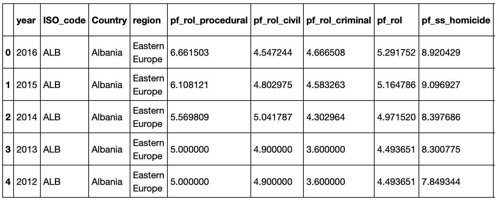
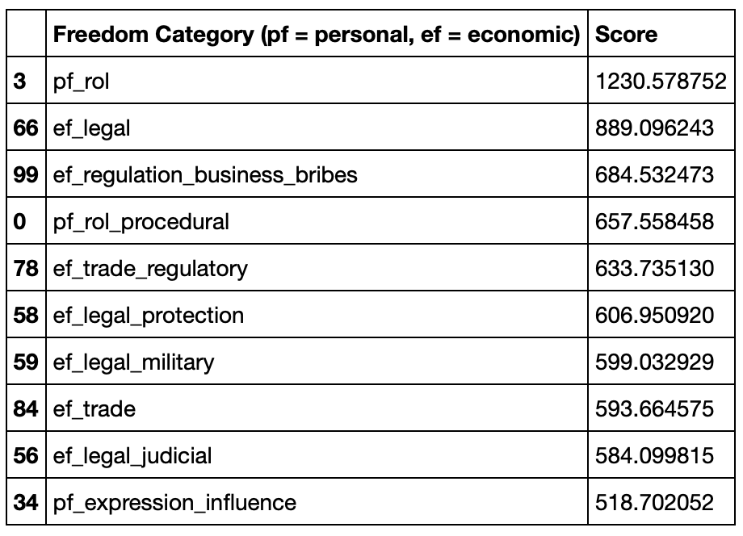
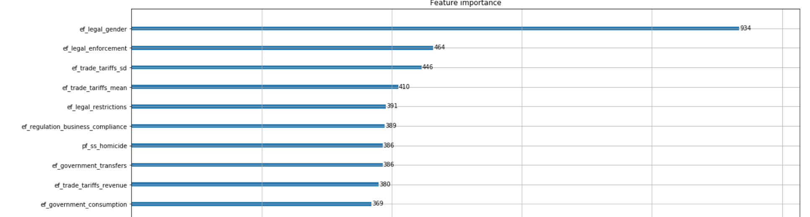
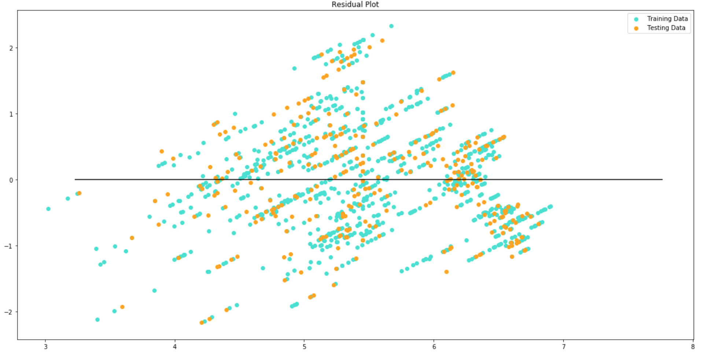

## Can Freedom Predict Happiness? | A Machine Learning Exploration

### Project Description

Using Data fron the Human Freedom Index and the Happiness Index, I attempted to answer the question: do freedom measures correlate with happiness measures in a way that can be predicted, or at least provide actionable information? This is an exploration of machine learning techniques, which also builds upon my earlier analysis comparing/contrasting these same datasets to determine whether these techniques will return similar or different insights from the original analysis. 

### Data Sources:

1. #### Happiness Datasets:
     * [World Happiness Report (2019)](https://worldhappiness.report/ed/2019/)
     * [Additional World Happiness Report data on Kaggle](https://www.kaggle.com/unsdsn/world-happiness) (includes happiness scores and rankings from the Gallup World Poll)

2. #### Human Freedom Datasets:
     * [Human Freedom Index from the Cato Institute](https://www.cato.org/human-freedom-index-new) (includes the basic freedom scores and rankings) 
     * [Human Freedom Index exploration on Kaggle](https://www.kaggle.com/gsutters/the-human-freedom-index#hfi_cc_2018.csv) (breaks Cato data into smaller subsets for more detailed study)
     
### Basic Libraries Used (additional libraries in Project Steps):
    ```
    import pandas as pd
    import numpy as np
    import matplotlib.pyplot as plt
    ```

### Project Steps: Overview

   * Data Prep
   * Feature Selection
   * Correlation + Residual Plots
   * Regression + Scoring Section 1: SKLearn and Train/Test/Split
   * Regression + Scoring Section 2: Keras and TensorFlow
   * Plotting value changes using matplotlib: https://keras.io/visualization/
   * Clustering and Forecasting in Tableau: https://help.tableau.com/current/pro/desktop/en-us/clustering.htm
   
### Data Prep
I imported and merged my datasets, replaced NAN values with column mean values, and saved my new dataframe to csv for later use.



### Feature Selection

#### Libraries Used:
##### Univariate selection and correlation matrix:
    ```
    from sklearn.feature_selection import SelectKBest
    from sklearn.feature_selection import chi2, f_regression
    import seaborn as sns
    ```
##### Feature importance using XG Boost:
    ```
    from numpy import loadtxt
    from xgboost import XGBClassifier
    from xgboost import plot_importance
    ```
1. #### Univariate Selection: SelectKBest
Finding Top 10 Best Features using SelectKBest class (selects those features that have the strongest relationship with the output variable, "Happiness Score")
The SKlearn library provides the SelectKBest class that can be used with a suite of different statistical tests. The example below uses the chi-squared (chi²) test for to select 10 of the best features from the combined dataset, using "Happiness Score" as the y value.



2. #### Plot a Heatmap Correlation Matrix using the Seaborn Library
Third type of feature selection: correlation reveals which features are most related to each other and/or to the target variable, "Happiness score". Shows both positive (green) and negative (red) correlations.
3. #### Used feature importance calculated by XGBoost (Gradient booster) to perform feature selection. (See: https://machinelearningmastery.com/feature-importance-and-feature-selection-with-xgboost-in-python/)


### Linear Regression Modeling and Scoring Round 1: Using SKLearn and Train/Test/Split 

#### Libraries Used:
    ```
    from sklearn.model_selection import train_test_split
    from sklearn.linear_model import  LinearRegression
    from sklearn.metrics import mean_squared_error, r2_score
    ```

1. #### I imported SKLearn models and reshaped values to fit X/y model. I used train_test_split to split data into training and testing sets. I plotted the residuals for the training and testing data, to clarify: is linear regression appropriate for this data? (If the points in a residual plot are randomly dispersed around the horizontal axis, a linear regression model is appropriate for the data; otherwise, a non-linear model is more appropriate.)


ANSWER: YES -- LINEAR REGRESSION IS APPROPRIATE!

2. #### I fit the model to the training data and calculated the scores:
    ```
    Training Score: 0.4641304308674661
    Testing Score: 0.46980650097659515
    ```
3. #### I scaled the data:
Scores on Linear Regression are OK...but could they improve if we scale the data?
    ````
    Training Score (scaled y): 0.8098205729527982
    Testing Score (scaled y): 0.7823787917258888
    ````
(ANSWER: YES, SCALING IMPROVED THE SCORES!)

### Linear Regression Modeling and Scoring Round 2: Regression with Keras and TensorFlow
Article on how to do a regression problem in Keras: https://machinelearningmastery.com/regression-tutorial-keras-deep-learning-library-python/
START WITH IMPORTING MODELS AND DATA (using csv saved earlier for a "fresh start")

#### Libraries Used:
    ```
    from keras import backend as K
    from tensorflow.keras.models import Sequential 
    from tensorflow.keras.layers import Dense
    ```

### Findings

Interestingly, feature select methods show that the majority of top-10 relevant features relate to economic freedoms (7/10) rather than personal freedoms (3/10), which is the same conclusion we reached in Project 1 in the original exploration of this data. Additionally, 
